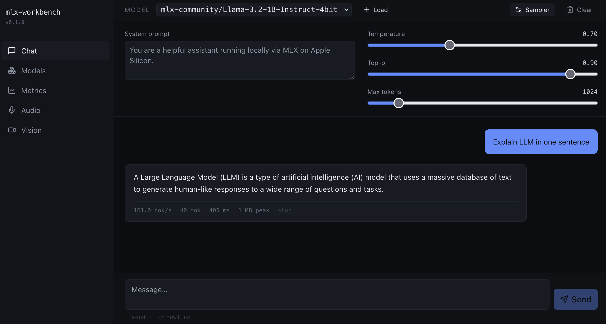
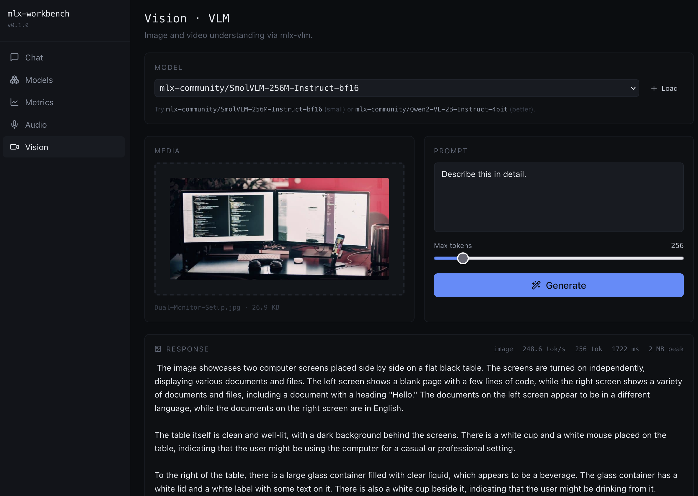
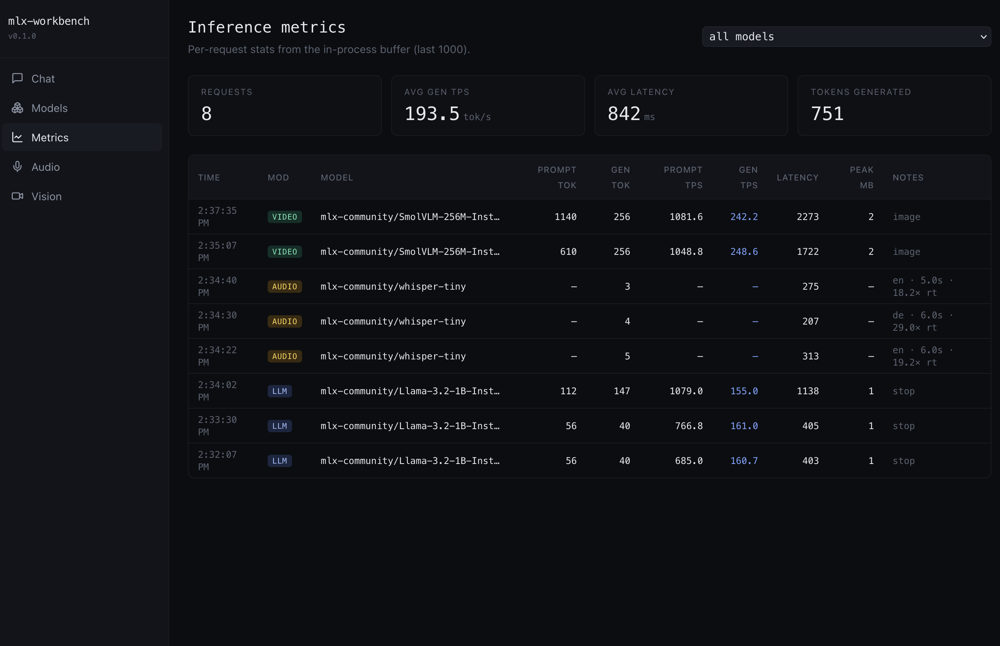

# MLX Workbench

Local inference server for LLM, audio, and vision models on Apple Silicon.

**FastAPI** backend · **React + Vite** frontend · **mlx-lm** · **mlx-whisper** · **mlx-vlm**

[](LICENSE)

<table>
  <tr>
    <td></td>
    <td></td>
    <td></td>
  </tr>
  <tr>
    <td align="center">LLM chat with sampler controls</td>
    <td align="center">Vision · image &amp; video understanding</td>
    <td align="center">Live inference metrics</td>
  </tr>
</table>

## Requirements

- macOS on Apple Silicon (MLX requires Metal)
- Python 3.14
- Node 20+
- [uv](https://docs.astral.sh/uv/)

## Setup

```bash
bash scripts/setup.sh
```

This installs Python deps via `uv` and frontend deps via `npm`.

## Run

```bash
# Terminal 1 — backend
uv run uvicorn main:app --reload --port 8000 --app-dir backend

# Terminal 2 — frontend
cd frontend && npm run dev
```

- UI: <http://localhost:3000>
- API docs: <http://localhost:8000/docs>

## Usage

### LLM (text generation)

Load a model from [mlx-community](https://huggingface.co/mlx-community) on HuggingFace:

```bash
curl -X POST http://localhost:8000/llm/load \
  -H 'Content-Type: application/json' \
  -d '{"model_id": "mlx-community/Llama-3.2-1B-Instruct-4bit"}'
```

Stream a chat response:

```bash
curl -X POST http://localhost:8000/llm/chat \
  -H 'Content-Type: application/json' \
  -d '{
    "model_key": "llm::mlx-community/Llama-3.2-1B-Instruct-4bit",
    "messages": [{"role": "user", "content": "Hello!"}],
    "stream": true
  }'
```

### Audio (transcription)

Load a Whisper model:

```bash
curl -X POST http://localhost:8000/audio/load \
  -H 'Content-Type: application/json' \
  -d '{"model_id": "mlx-community/whisper-small-mlx"}'
```

Transcribe an audio file:

```bash
curl -X POST http://localhost:8000/audio/transcribe \
  -F 'model_key=audio::mlx-community/whisper-small-mlx' \
  -F 'file=@recording.mp3'
```

### Vision (image / video understanding)

Load a vision model:

```bash
curl -X POST http://localhost:8000/video/load \
  -H 'Content-Type: application/json' \
  -d '{"model_id": "mlx-community/SmolVLM-256M-Instruct-bf16"}'
```

Describe an image or video:

```bash
curl -X POST http://localhost:8000/video/generate \
  -F 'model_key=video::mlx-community/SmolVLM-256M-Instruct-bf16' \
  -F 'prompt=Describe this in detail.' \
  -F 'file=@photo.jpg'
```

### Model management

```bash
# List all loaded models
curl http://localhost:8000/models/

# Unload a model
curl -X DELETE http://localhost:8000/models/llm::mlx-community/Llama-3.2-1B-Instruct-4bit
```

## Layout

```
backend/
  main.py               FastAPI app and lifespan
  config.py             pydantic-settings, .env support
  routers/
    llm.py              /llm/load, /llm/load-stream, /llm/chat, /llm/metrics
    audio.py            /audio/load, /audio/load-stream, /audio/transcribe
    video.py            /video/load, /video/load-stream, /video/generate
    models.py           /models/ (list), DELETE /models/{key}
    health.py           /health/, /health/ready, /health/info
  services/
    model_registry.py   Loaded-model cache with streaming download progress
    llm_service.py      mlx-lm wrapper with chat templating and SSE streaming
    audio_service.py    mlx-whisper wrapper
    vision_service.py   mlx-vlm wrapper
    mlx_runtime.py      Single-threaded MLX executor (Metal GPU stream safety)
    load_progress.py    tqdm → SSE bridge for download progress
    metrics.py          In-process ring buffer for inference metrics
  utils/
    logger.py
frontend/
  src/
    App.tsx             Router and nav
    api/                axios client and SSE helper
    store/              Zustand state (model selection, sampler, chat history)
    components/         Sidebar nav
    pages/              Chat, Models, Metrics views
```

## Environment variables

All settings are optional and can be set in a `.env` file at the project root:

| Variable | Default | Description |
|---|---|---|
| `HF_TOKEN` | — | HuggingFace token for gated models |
| `UPLOAD_DIR` | `/tmp/mlx_uploads` | Temp dir for uploaded audio/video files |
| `MAX_UPLOAD_MB` | `500` | Max upload size |
| `MLX_MAX_TOKENS` | `2048` | Default max tokens for generation |
| `MLX_TEMPERATURE` | `0.7` | Default temperature |
| `MLX_TOP_P` | `0.9` | Default top-p |

## Contributing

Contributions are welcome. Please open an issue before submitting a pull request for non-trivial changes so we can align on the approach.

- Keep changes focused — one thing per PR.
- All code must run locally on Apple Silicon without any external services.

## License

MIT — see [LICENSE](LICENSE).
